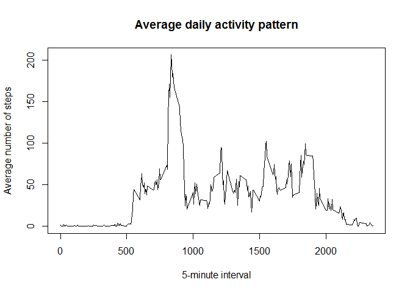

# Reproducible Research: Peer Assessment 1


## Loading and preprocessing the data
After loading the required libraries, the data is loaded and the date variable is converted to date format


```r
library(dplyr)
```

```
## 
## Attaching package: 'dplyr'
## 
## The following objects are masked from 'package:stats':
## 
##     filter, lag
## 
## The following objects are masked from 'package:base':
## 
##     intersect, setdiff, setequal, union
```

```r
library(ggplot2)
# Read data file
data <- read.csv("activity.csv")
# Convert date variable to date format
data$date <- as.Date(data$date, "%Y-%m-%d")
```


## What is mean total number of steps taken per day?
Using the dplyr library, the data is grouped by date and then the sum of steps for each day is calculated.

```r
# Group the data frame by date
group_date <- group_by(data, date)
# Calculate the sum of steps by day
total_steps_date <- summarise(group_date, total_steps = sum(steps, na.rm = TRUE))
```

With that data, the histogram with the total number of steps per day is created.

```r
#Histogram of total steps per day
hist(total_steps_date$total_steps, main = "Total steps per day", xlab = "Steps", col = "green", breaks = 8)
```

 

Mean of the total number of steps taken per day.

```r
as.numeric(summarise(total_steps_date, mean = mean(total_steps)))
```

```
## [1] 9354.23
```

Median of the total number of steps taken per day

```r
as.numeric(summarise(total_steps_date, median = median(total_steps)))
```

```
## [1] 10395
```


## What is the average daily activity pattern?
Using the dplyr library, the data is grouped by interval and then the mean of steps for each interval is calculated.

```r
# Group the data frame by interval
group_interval <- group_by(data, interval)
# Calculate the mean of steps by interval
avg_steps_interval <- summarise(group_interval, avg_steps = mean(steps, na.rm = TRUE))
```

Create a plot with the average daily activity pattern.

```r
plot(avg_steps_interval$interval, avg_steps_interval$avg_steps, type = "l", xlab = "5-minute interval", ylab = "Average number of steps", main = "Average daily activity pattern")
```

 

The interval with the maximum number of steps (on average) is calculated

```r
as.numeric(filter(avg_steps_interval, avg_steps == max(avg_steps))[1,1])
```

```
## [1] 835
```

## Imputing missing values
First step is to get a boolean vector with the NA values and then count the number of TRUE values.

```r
na_vector <- is.na(as.numeric(data[,1]))
length(na_vector[na_vector == TRUE])
```

```
## [1] 2304
```

In order to replace NA values, the original dataset is merged with the average steps per day using the common interval variable. Then, a new variable is added to replace NAs values with the value of the average steps for that interval. Lastly, the avg_steps column is removed to clean the new dataset.

```r
#Merge original dataset with the average steps per day using the common interval variable
temp_merge<-merge(data, avg_steps_interval, by.x = "interval", by.y = "interval", all = TRUE)
#Add a new variable to replace NAs values with the value of the average for that interval
temp_merge<-mutate(temp_merge, steps_filled = ifelse(is.na(steps), avg_steps, steps))
#Remove the avg_steps column to clean the dataset
temp_merge<-select(temp_merge, -avg_steps)
```

To create the histogram of the total number of steps taken each day, the new dataset is grouped by date and the sum of steps by day is calculated.

```r
group_date <- group_by(temp_merge, date)
total_steps_date <- summarise(group_date, total_steps = sum(steps_filled, na.rm = TRUE))
hist(total_steps_date$total_steps, main = "Total steps per day", xlab = "Steps", col = "green", breaks = 8)
```

 

Mean of the total number of steps taken per day with the new dataset.

```r
as.numeric(summarise(total_steps_date, mean = mean(total_steps)))
```

```
## [1] 10766.19
```

Median of the total number of steps taken per day with the new dataset.

```r
as.numeric(summarise(total_steps_date, median = median(total_steps)))
```

```
## [1] 10766.19
```

## Are there differences in activity patterns between weekdays and weekends?
First step is to create a factor variable using a vector of weekdays names to add a new factor variable in the previous dataset.

```r
# Vector of weekdays names
weekdays <- c('Monday', 'Tuesday', 'Wednesday', 'Thursday', 'Friday')
# Add a new variable factoring between weekday and weekend
temp_merge<-mutate(temp_merge, date_type = factor((weekdays(temp_merge$date) %in% weekdays), levels=c(FALSE, TRUE), labels=c('weekend', 'weekday')))
```
Now a plot is created using the new factor variable to display the average of steps by type of day and interval.

```r
# Calculate the average steps by interval
group_interval <- group_by(temp_merge, interval, date_type)
avg_steps_interval <- summarise(group_interval, avg_steps = mean(steps_filled, na.rm = TRUE))
#Plot the average steps per day type *weekend or weekday)
ggplot(avg_steps_interval, aes(interval, avg_steps, group=1)) +
  geom_line() + 
  facet_grid(date_type ~ .) + 
  labs(title = "Average steps by day type", x = "5-minute interval", y = "Average number of steps")
```

 


